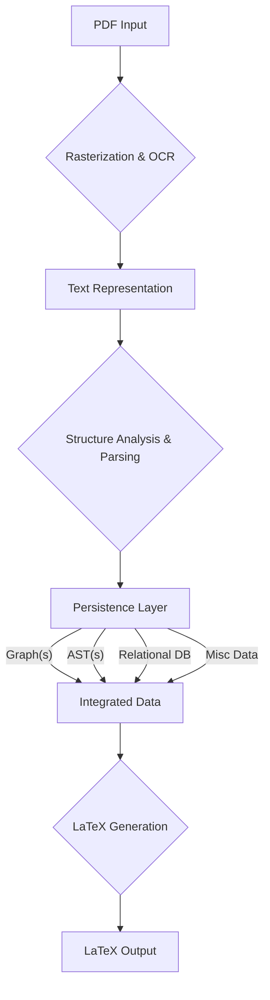
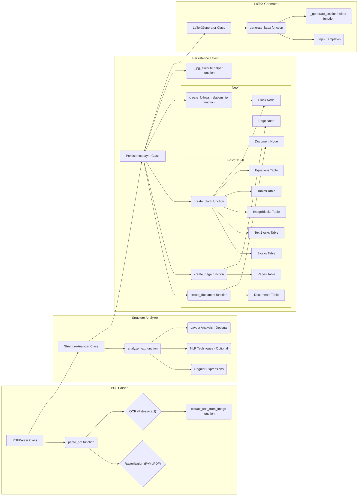

# pdf-to-latex

This project aims to convert PDF documents to LaTeX, preserving the original document's structure and formatting with high fidelity.  The pipeline utilizes a robust architecture incorporating OCR, structural analysis, and a persistence layer (PostgreSQL and Neo4j) to manage extracted data and facilitate accurate LaTeX generation.

## Features

* **Robust PDF Processing:** Handles both text-based and scanned PDFs.
* **OCR Integration:**  Uses Optical Character Recognition (OCR) to extract text from scanned images.
* **Structure Analysis:**  Analyzes the document's logical structure (headings, paragraphs, lists, tables, figures, equations).
* **Persistence Layer:**  Stores extracted data in PostgreSQL (relational data) and Neo4j (graph relationships) for efficient querying and LaTeX generation.
* **Faithful LaTeX Generation:**  Produces LaTeX code that accurately reflects the original document's content and formatting.
* **Modular Design:**  Allows for customization and extension of individual pipeline components.
* **Scalability:** Designed to handle large PDF documents.

## Diagrams:

###  Overall



### Detailed




## Architecture

The pipeline comprises three main stages:

1. **PDF to Text Representation:**  The input PDF is processed using OCR (if necessary) to extract text and identify basic layout elements.

2. **Text Representation to Persistence Layer:**  The extracted text and layout information are analyzed to determine the document's structure.  This data is then stored in:
    * **PostgreSQL:**  Stores relational data such as document metadata, page information, text content, table data, equation representations, and metadata about images and other unclassified elements.
    * **Neo4j:** Stores the relationships between document elements as a graph, capturing the document's logical flow and structure.

3. **Persistence Layer to LaTeX:**  The structured data in the persistence layer is used to generate LaTeX code.  This stage leverages the graph representation in Neo4j and queries PostgreSQL to assemble the final LaTeX output.

## Installation

1. **Clone the Repository:**
   ```bash
   git clone https://github.com/your-username/pdf-to-latex.git # Replace with your repo URL
   ```

2. **Set up a Virtual Environment (Recommended):**
   ```bash
   python3 -m venv venv
   source venv/bin/activate  # Activate the environment (Linux/macOS)
   venv\Scripts\activate  # Activate the environment (Windows)
   ```

3. **Install Dependencies:**
   ```bash
   pip install -r requirements.txt
   ```
   Create a `requirements.txt` file listing dependencies (e.g., `psycopg2` for PostgreSQL, `py2neo` for Neo4j, OCR library, NLP libraries).

4. **Database Setup:**
    * Install and configure PostgreSQL and Neo4j.
    * Create the necessary database schemas (see database schema design in documentation).

## Usage

1. **Data Preparation:**  No specific data preparation is required, although pre-processing PDFs (e.g., cleaning, enhancing image quality) might improve results.

2. **Run the Pipeline:**
   ```bash
   python run_pipeline.py --input your_pdf_file.pdf --output output.tex
   ```
   The script will process the PDF and generate the LaTeX file.

3. **Configuration:**  Configure pipeline parameters (e.g., OCR engine, database connection details) in a configuration file or as command-line arguments.

## Project Structure

* `run_pipeline.py`: The main script to execute the pipeline.
* `pdf_parser.py`: Module for PDF processing and OCR.
* `structure_analyzer.py`: Module for structural analysis and data extraction.
* `persistence_layer.py`: Module for interacting with the persistence layer.
* `latex_generator.py`: Module for LaTeX generation.
* `database_schemas/`: SQL scripts for database schema creation.
* `README.md`: This file.
* `requirements.txt`: Lists project dependencies.

## Limitations

* **Accuracy:**  The accuracy of the generated LaTeX depends on the quality of the input PDF and the performance of the OCR engine.
* **Complex Layouts:** Highly complex layouts might pose challenges for structural analysis.
* **Performance:**  Processing very large PDFs can be time-consuming. Optimization strategies might be necessary.


## Future Work

* Improved handling of complex tables and figures.
* Integration with a vector database for semantic similarity search.
* Enhanced error handling and reporting.
* Automated testing framework.
* Support for more advanced LaTeX features.


## Contributing

Contributions are welcome! Please open an issue or submit a pull request.

## License

[MIT License]
